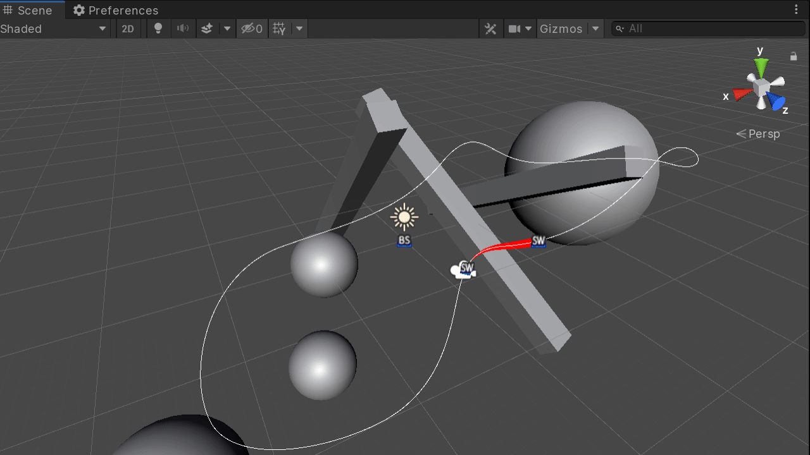

# JCMG Curves

## About

JCMG Curves is a 3D Bezier curve library focused on ease of use in both its API and Unity Editor integration.



## Overview

JCMG Curves offers a `MonoBehaviour` and `ScriptableObject` curve class which can be modified in the Unity Editor and/or inspector. A Bezier curve can be created as either a `MonoBehaviour` component in the form of `Bezier3DSpline` or as a `ScriptableObject` in the form of `Bezier3DSplineData`. Both have the same common interface as defined by `IBezier3DSplineData` and `IReadOnlySplineData` and offer methods for retreiving the position, rotation, and unit-length local vectors for Up, Left, Right, etc... for a point along the spline based on either a normalized value [0-1] of its total length or on a set distance.

The primary difference between these two options is that `Bezier3DSpline`' `Transform` is taken into account when accessing its APIs and so the positions, rotations, and vectors it return are transformed based on its `Transform`'s position and rotation, while all similar APIs for `Bezier3DSplineData` do not and are effectively in the World coordinate space. It is easy to copy spline data between these two types or others of the same type by using the Copy and Paste buttonss on their inspector.

This library was originally cloned from https://github.com/Siccity/Bezier3D and has been refactored and enhanced to include a simpler API, better readability, additional features, and several bug fixes. One of the key features I wanted to maintain that distinguished it from other similar libraries was the way that it cached and stored points along the curve so that it was possible to get a position or rotation along the curve at a set distance of the curve's total length rather than a normalized value of 0-1 over the entire length. This makes it possible to navigate along the spline based on a constant speed and is not affected by Bezier segments of differing lengths.

## Importing JCMG Curves

Using this library in your project can be done in two ways:
* **Releases:** The latest release can be found [here](https://github.com/jeffcampbellmakesgames/unity-curves/releases) as a UnityPackage file that can be downloaded and imported directly into your project's Assets folder.
* **Package:** Using the native Unity Package Manager introduced in 2017.2, you can add this library as a package by modifying your `manifest.json` file found at `/ProjectName/Packages/manifest.json` to include it as a dependency. See the example below on how to reference it.

```
{
	"dependencies": {
		...
		"com.jeffcampbellmakesgames.curves" : "https://github.com/jeffcampbellmakesgames/unity-curves.git#release/stable",
		...
	}
}
```

## Usage

To learn more about how to use JCMG CUrves, see [here](./usage.md) for more information.

## Contributing

For information on how to contribute and code style guidelines, please visit [here](./contributing.md).

## Support
If this is useful to you and/or you’d like to see future development and more tools in the future, please consider supporting it either by contributing to the Github projects (submitting bug reports or features and/or creating pull requests) or by buying me coffee using any of the links below. Every little bit helps!

[](https://ko-fi.com/I3I2W7GX)
