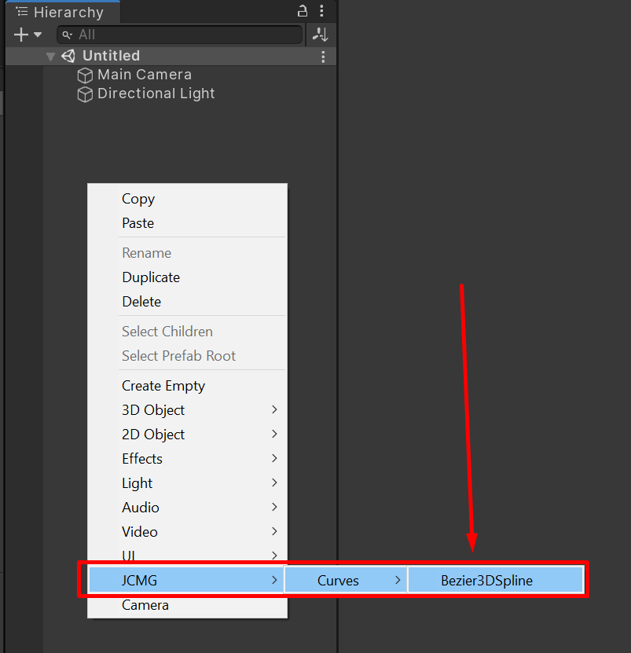
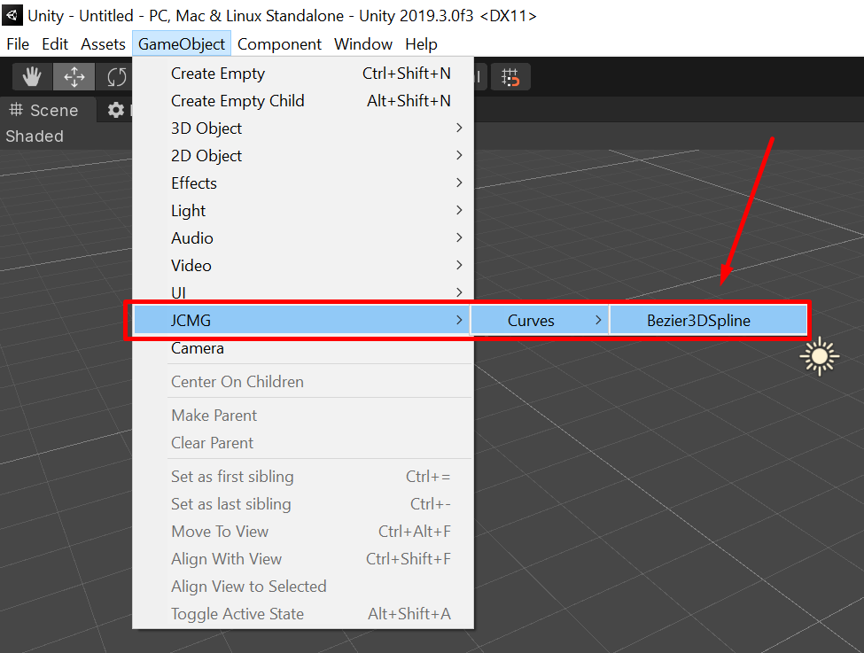
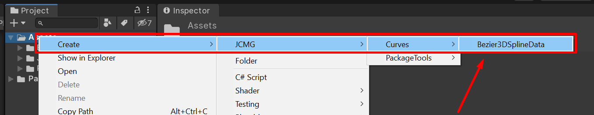
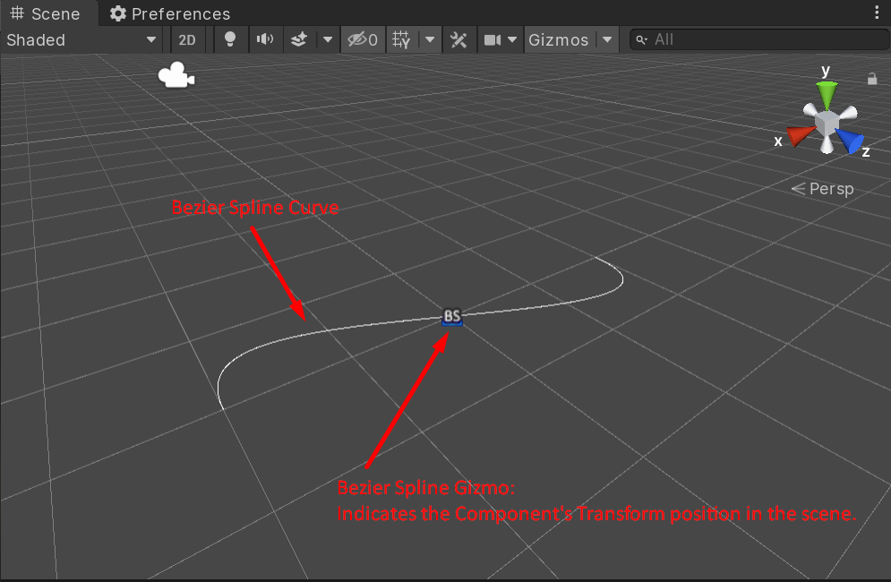
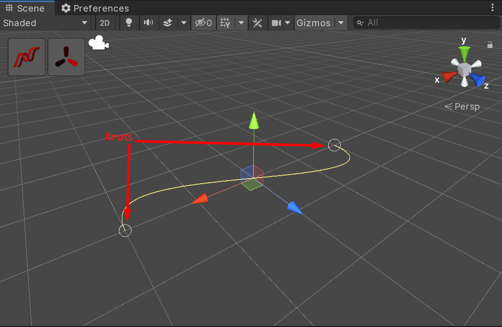
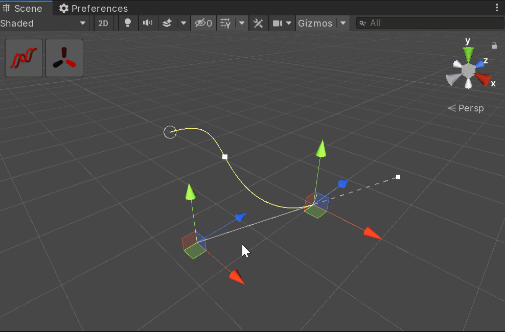
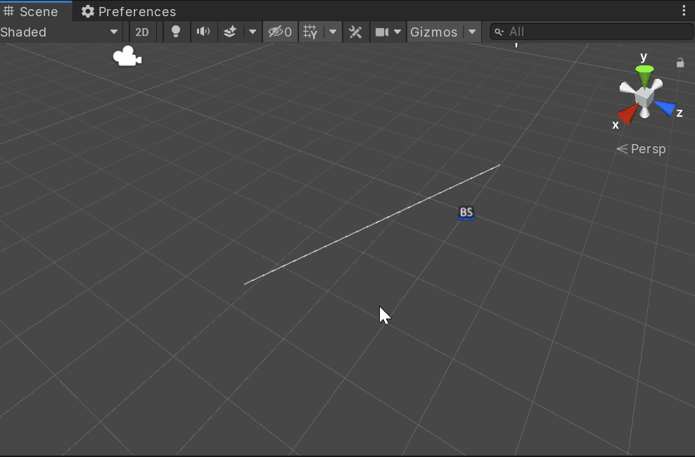
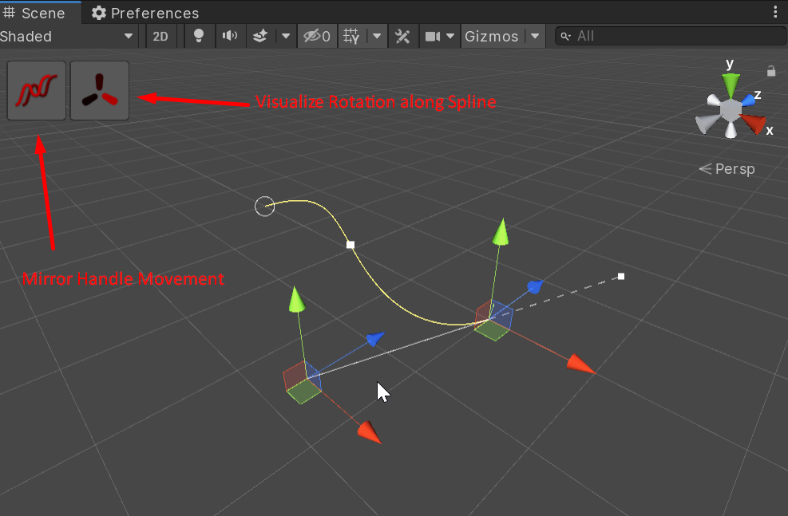
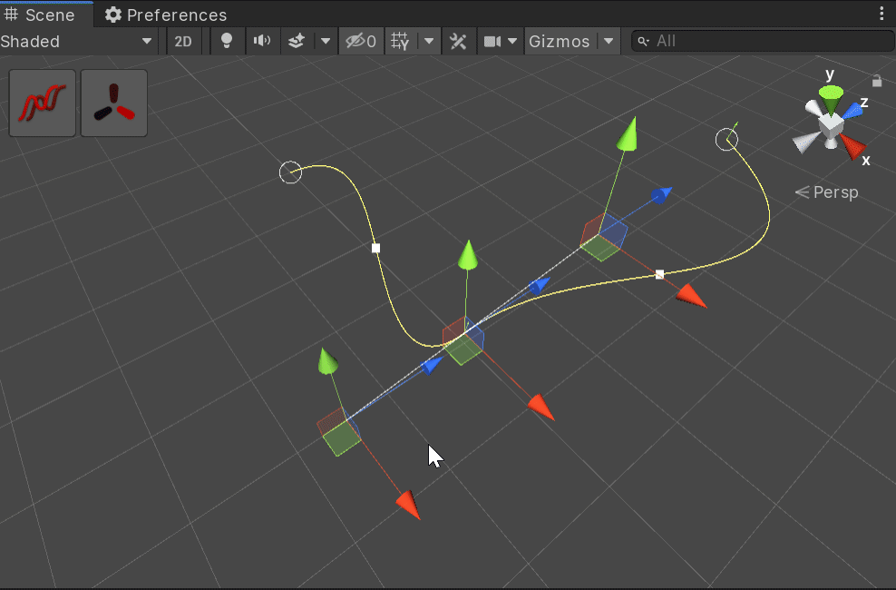
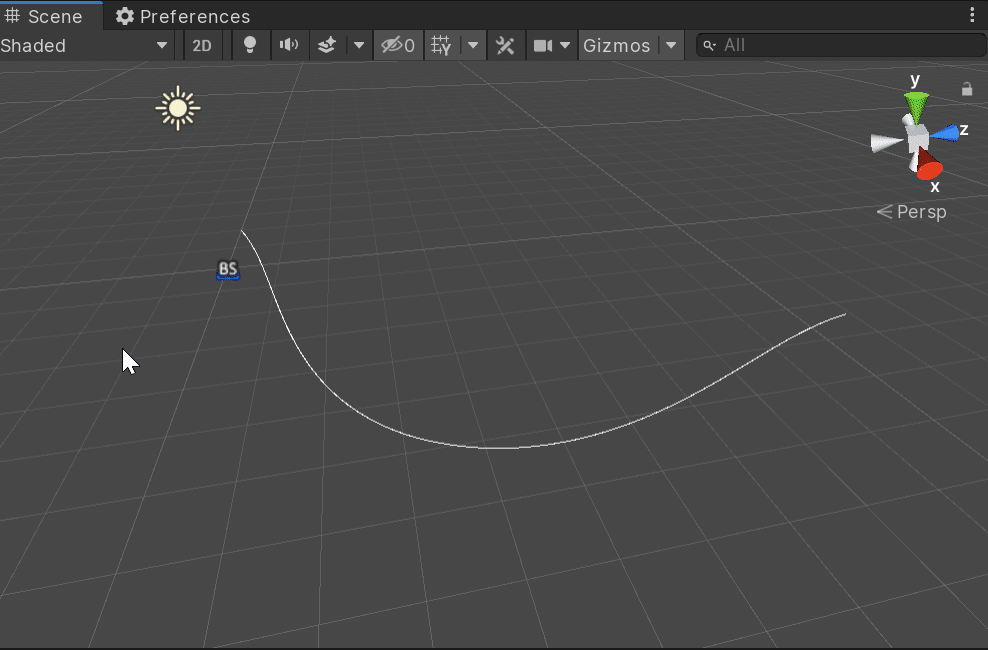

# Usage

## Creating a Curve as a MonoBehaviour

To create a Bezier Curve as a Scene object, create a new GameObject and add the `Bezier3DSpline` component (available at the menu path _JCMG/Curves/Bezier3DSpline_). 

Alternatively this can be done by selecting the menu item _GameObject/JCMG/Curves/Bezier3DSpline_ or right-clicking in the Scene Hierarchy window and selecting the menu item _/JCMG/Curves/Bezier3DSpline_.

After this type of curve has been created, its path can be seen as a Gizmo in the scene view even when unselected. Selecting the curve GameObject will enable you to modify the curve and visualize more information.

## Creating a Curve as a ScriptableObject

To create a Bezier Curve as a `ScriptableObject`, right-click in the Project window and select the menu item `JCMG/Curves/Bezier3DSplineData`. A curve in this form can only be seen and/or modified when selected in the Project window and will not be visible when unselected.

## Editing a Curve

When a curve has been created its initial two control points or `Knot`s as they are designated in code are initialized near the world origin (0,0,0). The primary way to be able to modify a curve is by selecting a `Knot`s in the Scene View and modifying its position and/or rotation via the default `Transform` hotkeys (`W` for Move, `E` for Rotate) or their related fields in the inspector. Other Hotkeys listed below enable additional commands.

### Hotkeys

| Key | Description |
|-----|-------------|
| Ctrl + I | Pressing Ctrl + I at the same time as the Bezier Curve is selected will flip the direction of the spline to its opposite | 
| CMD + Z and CMD + Y (OSX) or Ctrl + Z and Ctrl + Y (Windows)| Bezier Curve operations that modify the curve support undo and redo operations in the Unity Editor and will respond to the bound Undo and Redo buttons for that OS |
| F (while Knot is selected) | Pressing F while a Knot is selected will focus the last active SceneView camera on that Knot's position. |
| Delete (while Knot is selected) | Pressing Delete will remove the selected Knot from the Bezier Curve 				 | 
| Escape (while Knot is selected) | Pressing Escape will remove clear the selection state and deselect the selected Knot |

## Scene Controls

When a Bezier curve has been selected, an additional UI appears in the Scene View in the upper-left corner. These options are user-preferences and toggle on or off specific curve modification and visualization options.

### Mirror Handle Movement
When this option is enabled (green), moving one handle on a Bezier curve's Knot will cause its other handle if present to be automatically set to the opposite direction and length, effectively mirroring its movemennt. This can be useful for creating smooth transitions between two curve segments. When disabled (red), handles can be moved independently. 

### Visualize Rotation
What is considered `Up` from any point along the spline is determined based on the rotation of the `Knot`s before and after that point along the spline. Toggling this option to be enabled (green) will render the orientation of the point along the spline as a set of lines based on its rotation where the green line indicates `Up`, the blue line indicates `Forward`, and the red line indicates `Right`. This can be useful when objects may need to set their rotation based on the rotation of a point along the spline and so editing the one or more `Knot`'s rotation and visualizing that rotation is essential. When disabled (red), this visualization will not appear.

